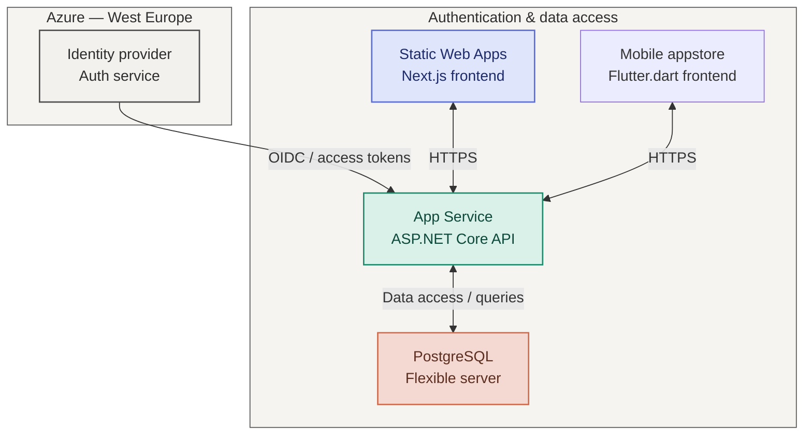

# Architecture

This document describes the baseline platform architecture for Acvento.

## Components

- Identity provider: handles authentication and issues tokens for the application. This will be a third party Auth service.
- Static Web Apps: hosts the Next.js frontend and serves the user-facing experience.
- App Service: runs the ASP.NET Core API and validates authenticated requests.
- PostgreSQL Flexible Server: stores application data in a managed relational database.

